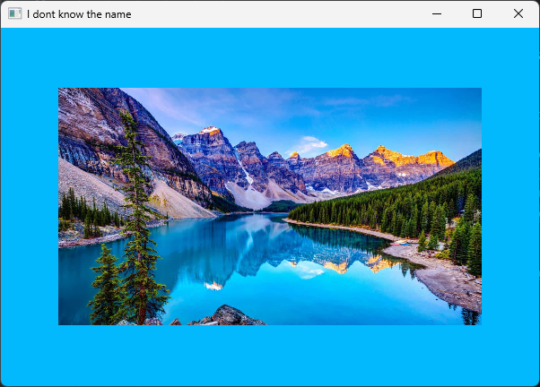
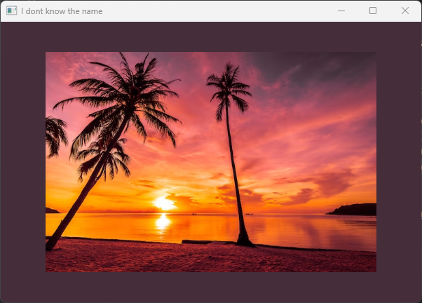
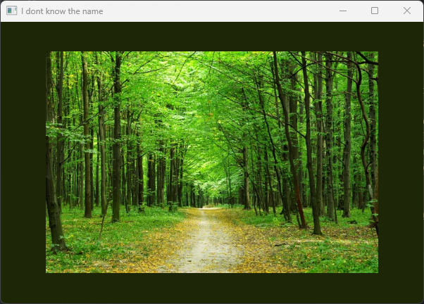
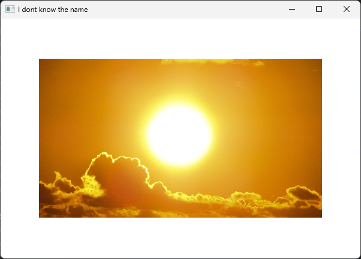

## <h2>This project is inspired by Instagram's story feature, where the background color dynamically changes based on the dominant color of the uploaded image. Using Java and JavaFX, this application allows users to drag and drop an image onto the interface. Upon dropping, the program detects the dominant color in the image and sets it as the background color, creating visually appealing effects reminiscent of Instagram stories</h2>

